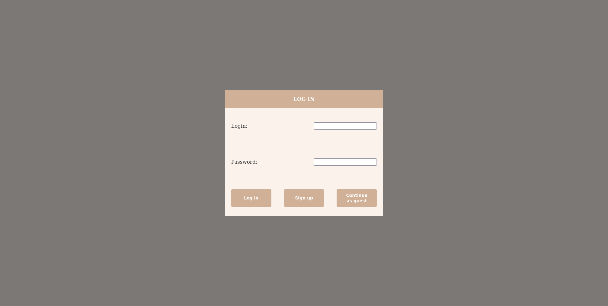
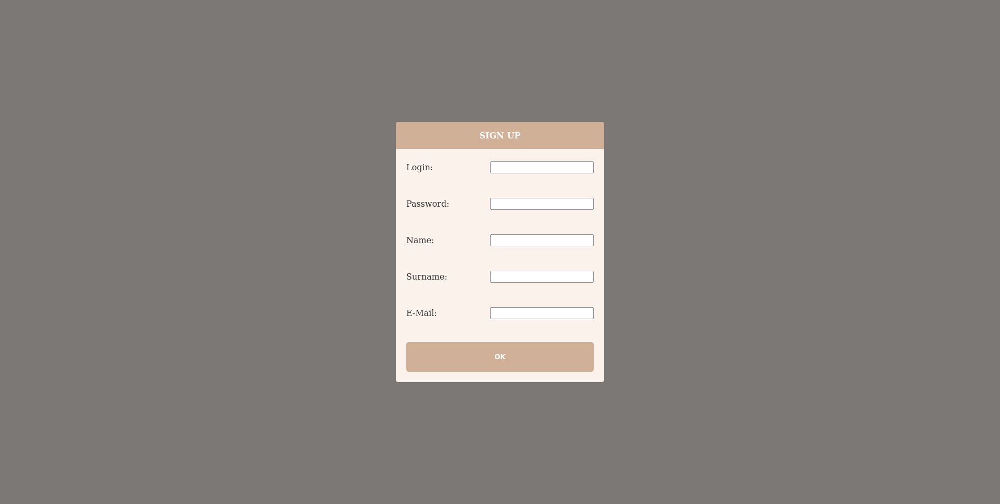
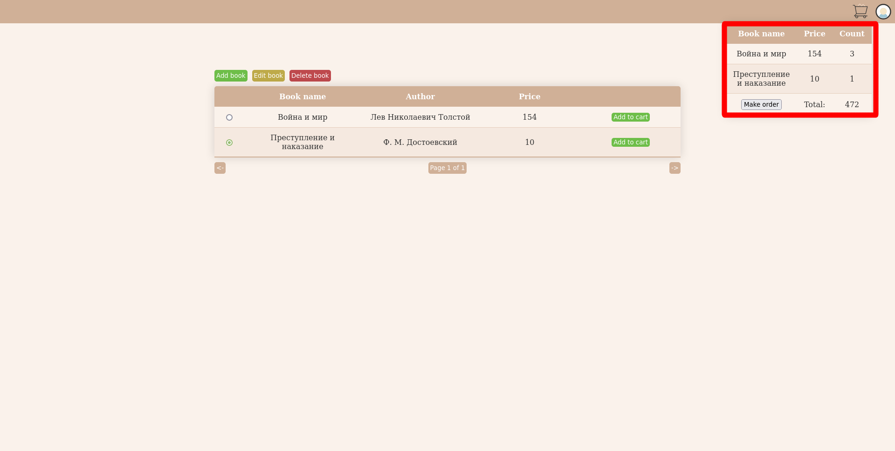
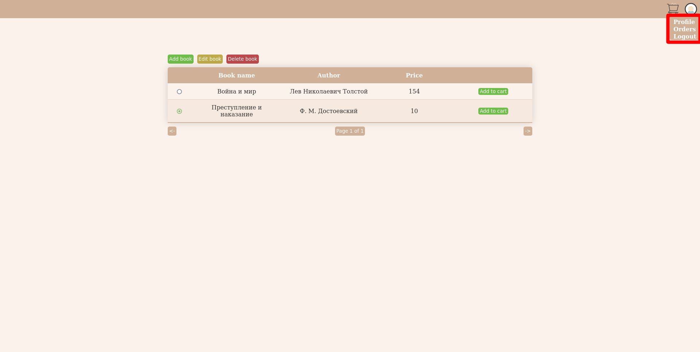
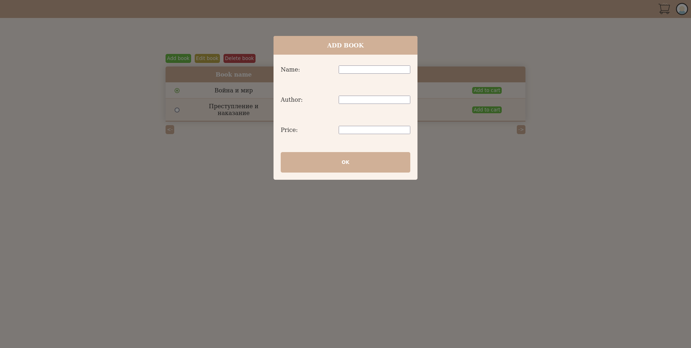
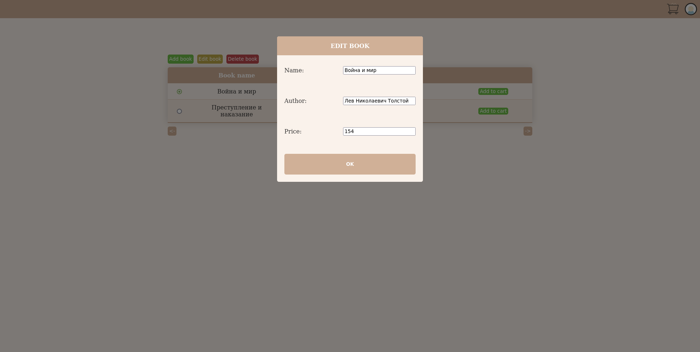
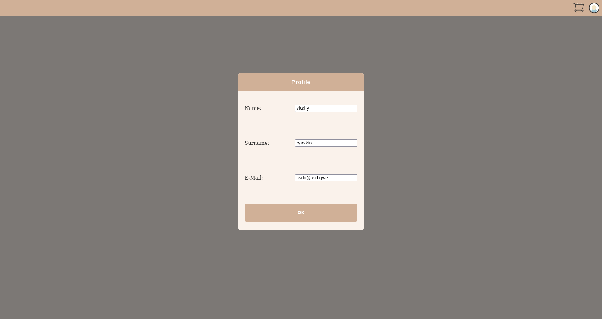

# Front-end для небольшого книжного магазина

## Изученное

Это небольшой учебный проект реализующий front-end для написанного мною API.

В нем я изучал:
- Основы стека html, css, javascript
- Основы фреймфорка Vue.js
- Модуль Vuex для хранения данных

## Функционал

Авторизация реализована с использованием JWT токенов, однако, как я узнал уже много позже, приведенная мною реализация не является наилучшим вариантом.

Имеются роли, в зависимости от них пользователю доступен различный функционал:
- admin:
    - Добавлять/изменять/удалять книги в общей таблице
    - Создание и оформление заказов
    - Редактирование профиля
- default:
    - Добавление книг в общую таблицу
    - Создание и оформление заказов
    - Редактирование профиля 
- guest может только смотреть таблицу со списком книг

Все поля проходят валидацию на клиенте (пароль > 6 символов, Email в определенном формате и т.д.)

### Авторизация

### Регистрация

### Страница с таблицей и выпадающим меню корзины

### Выпадающее меню сайта

### Добавление книги

### Изменение книги

### Редактирование профиля

